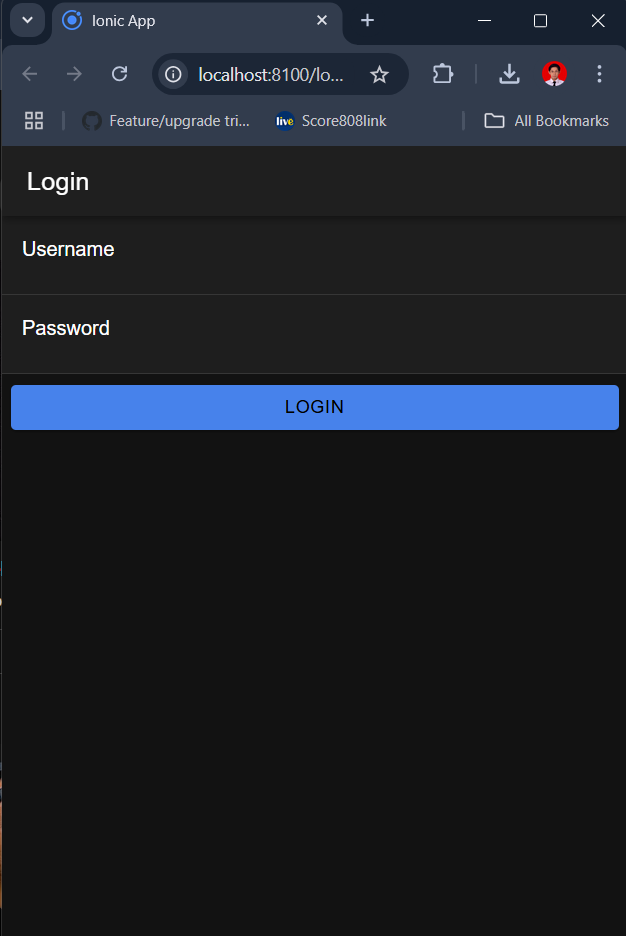
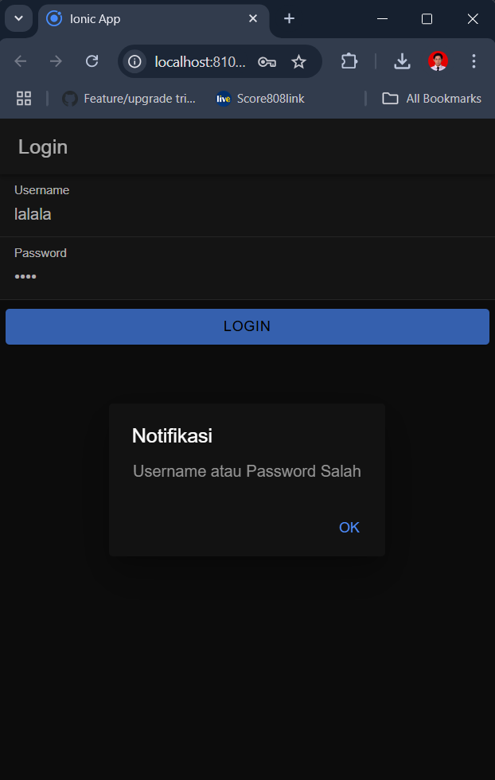

# Cara Kerja Login di Aplikasi Ionic dengan Angular
### 1. Form Login dan Input Pengguna
Pengguna mengakses halaman login dan mengisi form dengan email dan password.
Setelah pengguna menekan tombol login, aplikasi akan mengambil nilai email dan password dari input form untuk dikirim ke server.
### 2. Permintaan HTTP ke API Autentikasi
Aplikasi mengirim permintaan HTTP POST ke API autentikasi di server.
API ini dibangun dengan PHP, yang akan menangani logika validasi.
Data yang dikirim berisi email dan password pengguna dalam format JSON atau sebagai parameter POST.
### 3. Verifikasi dan Respons dari Server
API PHP menerima data, lalu melakukan pengecekan apakah email dan password cocok dengan data di database.
Jika valid, server akan mengirim respons berisi token autentikasi atau status login sukses.
Jika tidak valid, server mengirimkan pesan kesalahan, dan pengguna tetap berada di halaman login dengan notifikasi kesalahan.
### 4. Penyimpanan Token di LocalStorage
Setelah aplikasi menerima token autentikasi, token disimpan dalam localStorage.
Token ini akan digunakan untuk permintaan selanjutnya ke API, yang memungkinkan server mengenali pengguna yang sudah terautentikasi.
### 5. Implementasi Auth Guard untuk Proteksi Halaman
Auth Guard digunakan untuk memeriksa status login sebelum pengguna mengakses halaman tertentu.
Saat pengguna mencoba membuka halaman yang dilindungi, Auth Guard akan mengecek apakah ada token autentikasi di localStorage.
Jika token ada dan valid, pengguna dapat mengakses halaman tersebut. Jika tidak ada token atau token sudah kedaluwarsa, pengguna diarahkan kembali ke halaman login.
### 6. Proses Logout
Pada proses logout, aplikasi akan menghapus token dari localStorage untuk memastikan pengguna tidak dapat mengakses halaman yang dilindungi.
Pengguna kemudian diarahkan ke halaman login setelah token dihapus.

### Halaman Login

### Jika login gagal

### Halaman homepage
